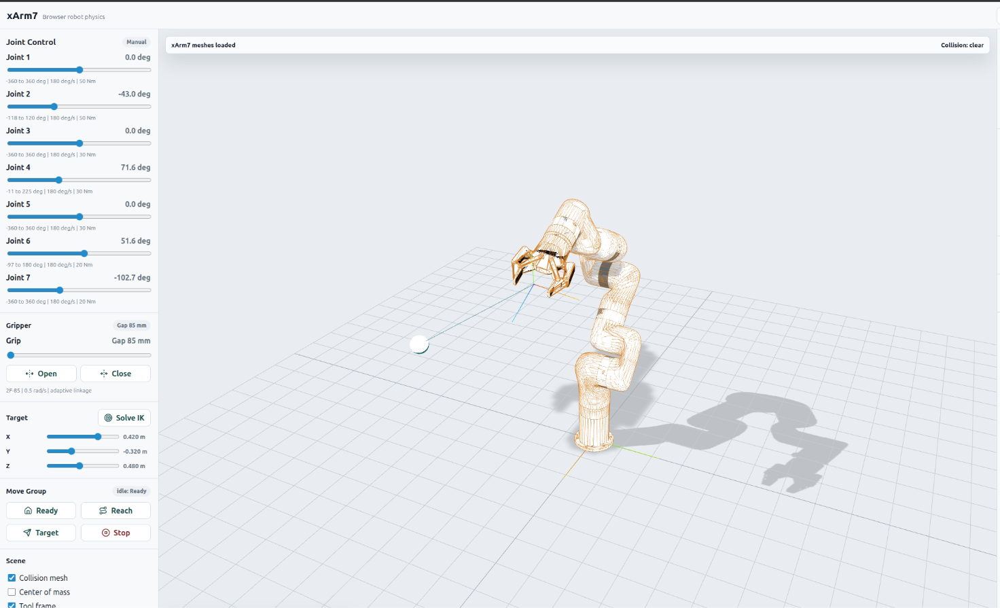

# Three.js Robot Workbench

An interactive browser workbench for the UR5e, Franka Research 3, and UFACTORY xArm7. It loads official visual and collision meshes, mounts a real Robotiq 2F-85 URDF, and provides kinematic motion, position-only IK, sampled collision planning, and robotics readouts.



## Run locally

Use Node.js `^20.19.0` or `>=22.12.0` (the Docker image uses Node 24):

```bash
npm ci
npm run dev
```

Vite prints the local URL, normally `http://localhost:5173`.

The project commands have separate meanings:

```bash
npm run typecheck  # strict TypeScript only
npm test           # focused unit tests only
npm run test:e2e   # Playwright browser smoke and layout tests
npm run build      # production bundle only
npm run check      # typecheck + unit tests + production build
npm run preview    # serve the completed production build
```

## Run with Docker

```bash
docker compose up --build
```

Open `http://localhost:5174`, or choose another host port:

```bash
APP_PORT=5175 docker compose up --build
```

Compose bind-mounts the repository at `/app` for live source updates and mounts `/app/node_modules` as a named volume so host dependencies never replace Linux dependencies. That volume persists across normal restarts. After changing `package-lock.json`, recreate it from the rebuilt image:

```bash
docker compose down -v
docker compose up --build
```

Stop without deleting the dependency volume with `docker compose down`.

## User-visible workflows

- Switch among UR5e, FR3, and xArm7 without reloading the page.
- Drive joints with sliders or the explicit Zero, Ready, Folded, and Reach presets.
- Play each robot's default keyframe action and stop any active motion.
- Drag the Cartesian target in the viewport or edit its XYZ sliders, then solve position-only CCD IK.
- Plan and execute named, joint, or pose targets through `MoveGroupLite`.
- Animate the Robotiq adaptive linkage and inspect its command and estimated jaw opening.
- Toggle official collision meshes, mounted-link inertial markers, total COM, and tool/TCP overlays.
- Inspect collision state, total mass, tool reach, and center-of-mass height.

The documented console API is in [docs/BROWSER_API.md](docs/BROWSER_API.md). Robot configuration fields and validation rules are in [docs/ROBOT_CONFIG.md](docs/ROBOT_CONFIG.md).

## Architecture

- `src/main.ts` bootstraps the app, binds high-level controls, schedules rendering, and coordinates motion.
- `src/app/robotRuntime.ts` owns a loaded arm plus optional gripper, collision tuples, all mounted inertials, mass, and disposal.
- `src/app/browserApi.ts` installs and clears the documented browser globals.
- `src/motion/` contains the joint store, motion cancellation, action sampling, CCD IK, and `MoveGroupLite`.
- `src/robots/` loads and validates the JSON registry. Structural relationships are derived from the loaded URDF hierarchy.
- `src/rendering/` contains the Three.js scene, URDF loader, overlays, target drag, materials, BVH setup, and disposal.
- `src/physics/` derives collision candidates and inertial ancestry and computes COM.
- `src/ui/` builds controls and reuses readout nodes.
- `public/*_description/` contains browser-ready URDF packages and retained upstream licenses.

## Adding a robot

1. Copy the required upstream description assets into `public/<package_name>` and retain their license.
2. Generate a static browser-readable URDF while preserving `package://<package_name>/...` mesh references.
3. Add `public/robots/<robot_id>/robot.json` following [docs/ROBOT_CONFIG.md](docs/ROBOT_CONFIG.md).
4. Add its config URL to `public/robots/index.json`.
5. Add Playwright coverage for its control count, Ready/Reach plans, initial target, assets, and canvas resize behavior.

No JSON inheritance layer is used; each small robot binding remains explicit.

## Important limitations

- Motion is kinematic. This is not a dynamic physics simulator and does not model acceleration, momentum, actuator control, or contact response.
- CCD IK solves tool/TCP position only. Orientation fields are accepted for API compatibility but produce a warning and are not solved.
- Collision planning samples a joint-space trajectory (up to roughly 30 intermediate samples plus the goal). It is not MoveIt, continuous collision detection, or a proof that the swept path is collision-free.
- The gripper jaw-gap readout interpolates the Robotiq 2F-85's published 85–8 mm range from its command joint.
- The app runs entirely in the browser and does not connect to robot hardware or ROS.

## Assets and licenses

Upstream repositories, commit IDs, generated-URDF notes, and local asset changes are recorded in [docs/ASSETS.md](docs/ASSETS.md). Project code is BSD-3-Clause under [LICENSE](LICENSE); vendored assets remain under their own licenses in `public/*_description/LICENSE`.
